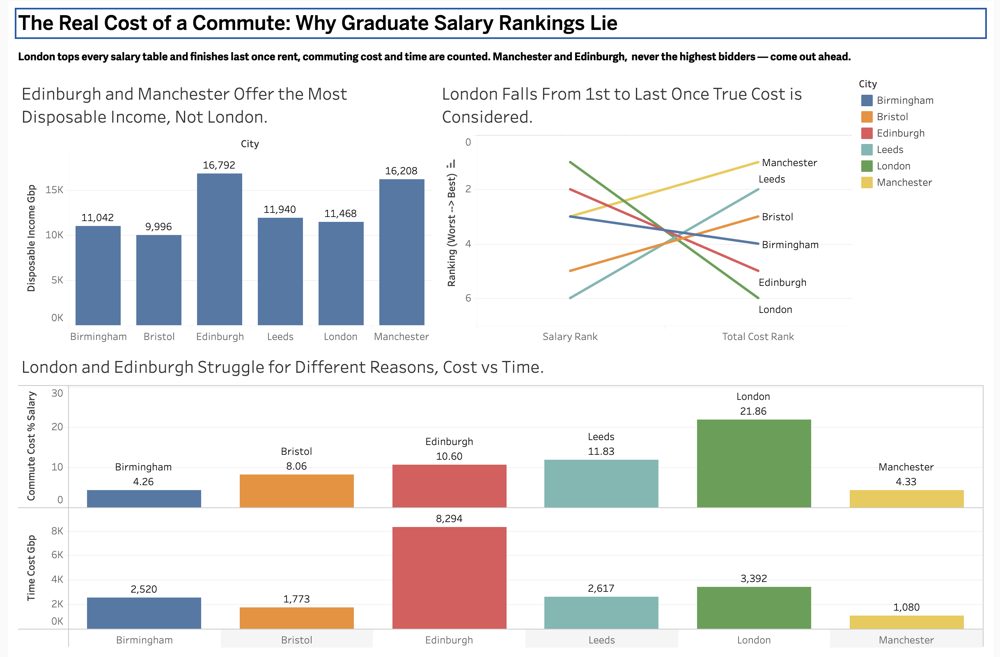

# The Cost of a Commute — Graduate Purchasing Power Across UK Cities

## Overview

Graduate job offers are typically compared on headline salary alone, but this ignores two costs that vary enormously by location: the cost of commuting into the role, and the cost of housing near it. A graduate choosing between offers in different UK cities is effectively choosing between different disposable-income outcomes, not different salaries. This project builds a rigorous, city-by-city comparison of graduate purchasing power across six UK cities, incorporating salary, rent, commuting cost, and commuting time, to determine where a graduate's money — and time — actually goes furthest.

Full problem statement and business objectives: [`docs/00_problem_statement.md`](docs/00_problem_statement.md)

## Table of Contents

- [Business Questions](#business-questions)
- [Tech Stack & Methodology](#tech-stack--methodology)
- [Project Structure](#project-structure)
- [Data](#data)
- [How to Run This Project](#how-to-run-this-project)
- [Findings](#findings)
- [Dashboard](#dashboard)
- [Key Recommendations](#key-recommendations)

## Business Questions

1. Where does a graduate's salary go furthest once fixed costs are removed?
2. How much of a graduate's income is absorbed by commuting specifically?
3. What is the true time cost of commuting, priced at the graduate's own wage?
4. Which cities reorder most dramatically once rent, commute cost, and time are all included?
5. How sensitive is the ranking to the choice of commute route?

## Tech Stack & Methodology
| Tool | Role in this project |
|---|---|
| SQL (PostgreSQL) | Data structuring, city-region mapping, KPI calculations, and the final ranked comparison |
| Tableau Public | Interactive, cross-filtered dashboard |

Given the project's small final dataset (six cities), all analysis was completed directly in SQL without a separate Python validation step — a deliberate scope decision consistent with also skipping a star schema in Milestone 5 (see `docs/01_data_dictionary.md`).

## Project Structure

```
graduate-commute-analysis/
├── data/
│   ├── raw/               # HESA/LEO salary data (small enough to commit directly)
│   ├── manual/             # commute and rent data, sourced and documented per city (tracked)
│  
├── sql/
│   ├── 01_schema.sql
│   ├── 02_cleaning.sql
│   ├── 03_analysis_queries.sql
│   └── 04_bi_data_model.sql
├── dashboard/              # Tableau workbook (.twbx)
├── docs/
│   ├── 00_problem_statement.md
│   ├── 01_data_dictionary.md
│   └── findings_summary.md
└── images/
    └── dashboard_screenshots/
```

## Data

**Bulk sources:**
- Graduate salary by region: [LEO Graduate Outcomes — Earnings by Region](https://explore-education-statistics.service.gov.uk/data-catalogue/graduate-outcomes-leo-provider-level-data/2020-21)
- Rent by city (one-bedroom average): [ONS Private rent and house prices, UK](https://www.ons.gov.uk/economy/inflationandpriceindices/bulletins/privaterentandhousepricesuk/july2026)

**Manually curated source:**
- Commute cost and time: one representative route per city, priced via the [National Rail Season Ticket Calculator](https://www.nationalrail.co.uk/tickets-railcards-and-offers/ticket-types/season-ticket-calculator/) on the date of collection. Full route list, prices, and collection dates documented in `data/manual/commute_data.csv` and `docs/01_data_dictionary.md`.

The salary dataset is small enough to commit directly to this repo (`data/raw/`) rather than gitignored — see the Data section of `docs/01_data_dictionary.md` for the full column reference and methodology notes (region-to-city mapping, Scotland's differing data collection methods, and the Birmingham commute cost estimate).

## How to Run This Project

```bash
git clone <https://github.com/d-iriele/graduate-commute-analysis>
cd graduate-commute-analysis
source .venv/bin/activate
pip install -r requirements.txt
```

Then follow the steps in the [Data](#data) section to populate `data/raw/`, and run the SQL scripts in order.

## Findings

Comparing graduate salaries alone across six UK cities produces a misleading picture of financial outcome. London — the highest-salary city (£31,800) — falls to last place (6th) on total cost of work once rent, commuting cost, and the monetary value of commuting time are accounted for, while Leeds rises from lowest salary to 2nd place. Manchester emerges as the strongest all-round city, ranking only 3rd on salary but 1st on total cost of work.

Full findings, methodology, and limitations: [`docs/findings_summary.md`](docs/findings_summary.md)

## Dashboard

Explore the live, interactive dashboard on Tableau Public: **[The Cost of a Commute — Graduate Purchasing Power Across UK Cities](https://public.tableau.com/app/profile/dennis.iriele/viz/TheRealCostofaCommute-GraduatePurchasingPowerAcrossUKCities_/Dashboard1?publish=yes)**



The dashboard includes an interactive filter — clicking any bar in the "Disposable Income" chart filters the other two charts to that city, letting you explore how salary rank, total cost rank, and the specific cost/time burden driving each city's position all move together.

## Key Recommendations

1. Treat headline salary as a starting point, not a decision-making number — a £4,800 salary gap can be outweighed by rent and commuting costs
2. Weigh commuting time explicitly, not just cost — London and Edinburgh struggle for genuinely different reasons
3. Manchester and Leeds deserve more attention in graduate job searches than salary alone suggests
4. The salary-to-outcome gap (rank_shift) is a reproducible metric worth tracking for regional economic policy

Full reasoning and evidence for each: [`docs/findings_summary.md`](docs/findings_summary.md)

## Skills Demonstrated

- **SQL**: window functions (RANK), multi-table joins with conditional mapping logic, iterative table rebuilding to correct schema gaps
- **Data sourcing & methodology**: combining bulk official statistics with manually curated, individually sourced data; explicit documentation of every judgment call (region-to-city mapping, route selection, estimation methods)
- **Data quality & validation**: sensitivity testing to confirm an estimated data point didn't materially affect conclusions
- **Data visualization**: Tableau Public dashboard including a slope chart for rank comparison, cross-filtering, and column banding
- **Business analysis**: translating a personal question into a structured, quantified, multi-audience recommendation set
- **Documentation**: transparent methodology notes throughout, distinguishing sourced data from estimates